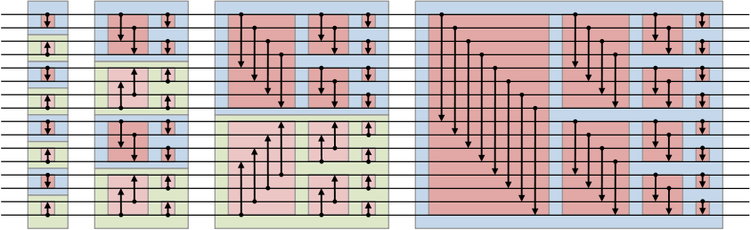

# BitonicSort Algorithm

This algorithm uses qsort to sort the local arrays in each processor before BitonicSort effectively begin.

To compile:

`mpic++ bitonicSort.c -o <name_executable>`

To run:

`mpirun -np <number_processors> <name_executable> <length_of_the_array_to_be_sorted>`


Pseudocode:

```

1. procedure BITONIC SORT (label, d)
2. begin
3.   for i := 0 to d − 1 do
4.     for j := i downto 0 do
5.       if (i + 1)st bit of label != jth bit of label then
6.         compare troca max(j);
7.       else
8.         compare troca min(j);
9. end BITONIC SORT

```
Visualization:


   