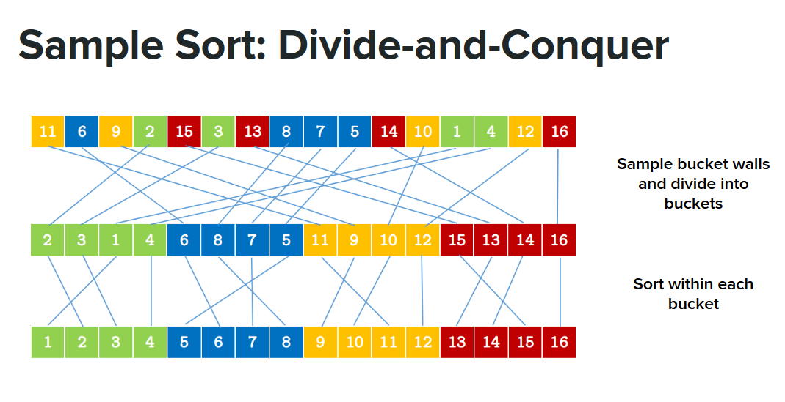

# SampleSort Algorithm

This algorithm uses qsort to sort the local arrays in each processor before SampleSort effectively begin.

To compile:

`mpic++ sampleSortQuick.c -o <name_executable>` or `mpic++ sampleSortIntro.c -o <name_executable>`

To run:

`mpirun -np <number_processors> <name_executable> <length_of_the_array_to_be_sorted>`


Pseudocode:

```

1. function sampleSort(A[1..n], k, p)
2.     if n / k < threshold then 
3.       smallSort(A) 
4.     select S = [S1, ..., S(p−1)k] randomly from
5.     sort S 
6.     [s0, s1, ..., sp−1, sp] <- [-∞, Sk, S2k, ..., S(p−1)k, ∞]
7.     for each a in A
8.      find j such that sj−1 < a <= sj
9.      place a in bucket bj
10.    return concatenate(sampleSort(b1), ..., sampleSort(bk))

```
Visualization:


   
